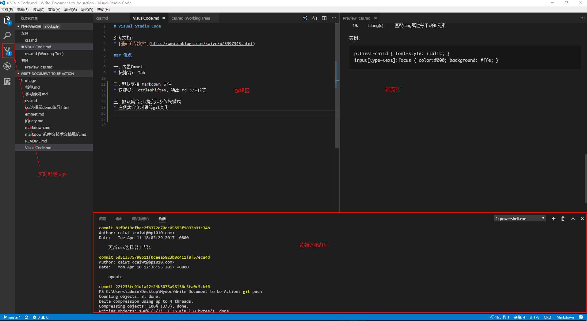

# Visual Studio Code

参考文档：
* [基础介绍文档](http://www.cnblogs.com/kaiye/p/5397345.html)

### 优点

一、内置Emmet
* 快捷键： Tab

二、默认支持 Markdown 文件
* 快捷键： ctrl+shift+v, 唤出 md 文件预览

三、默认集合git提交以及终端模式

* 左侧集合实时跟踪git变化
* 下侧集合终端shell以及调试区

四、支持html语法

实例：`

`
    

