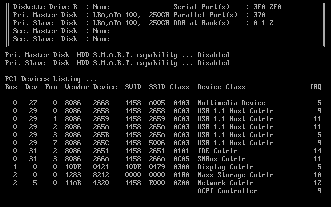

# Linux学习

## 计算机启动过程
> *boot的过程就是想办法将一小段程序装进内存，然后计算机才能正常运行，开始启动过程。*

计算机的启动过程分为四个阶段：

### 一、第一阶段：BIOS
上个世纪70年代初，"只读内存"（read-only memory，缩写为ROM）发明，开机程序被刷入ROM芯片，计算机通电后，第一件事就是读取它。
    
这个开机程序叫做“基本输入输出系统”(Basic Input/Output System )

#### 1.1 硬件自检

BIOS程序首先检查，计算机硬件能否满足运行的基本条件，这叫做"硬件自检"（Power-On Self-Test），缩写为POST。

如果硬件出现问题，主板会发出不同含义的蜂鸣，启动中止。如果没有问题，屏幕就会显示出CPU、内存、硬盘等信息。

##  Unix 哲学
> KISS (keep it simple, stupid)简单原则

    清晰，模块，组合，优化

    清晰：逻辑清晰，方便阅读和维护；
    模块：每个程序只做一件事；
    组合：接口相连，二进制通信；
    优化：先求运行，再求正确，最后求快。

## Linux 系统负荷
> 指令：uptime

    
